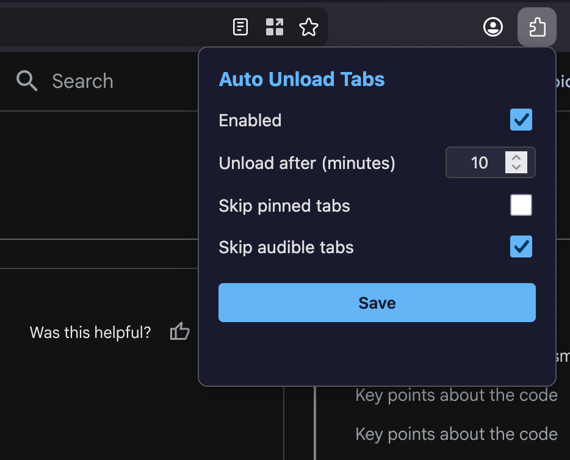

# Auto Unload Tabs

A Firefox extension that automatically discards (unloads) tabs that haven't been used for a configurable amount of time. Activity is detected via mouse movement, keyboard typing, and scrolling.

## Screenshot

## Features

- **Auto-unload idle tabs** — Discards tabs idle for 10 minutes (configurable 1–120 min)
- **Activity detection** — Tracks mouse movement, key presses, clicks, and scrolling
- **Pinned tab exemption** — Pinned tabs are skipped by default
- **Audible tab exemption** — Tabs playing audio are skipped by default
- **Popup settings** — Enable/disable, adjust timeout, toggle exemptions

## Install

1. Open `about:debugging` in Firefox
2. Click **This Firefox** → **Load Temporary Add-on**
3. Select `manifest.json` from this project folder

> Temporary add-ons are removed when Firefox closes. For persistent installation, the extension must be signed by Mozilla.

## How It Works

| Component | Role |
|---|---|
| `content.js` | Injected into every page. Listens for `mousemove`, `keydown`, `mousedown`, and `scroll` events. Sends an `activity` message to the background (throttled to once per 5 seconds). |
| `background.js` | Maintains a map of `tabId → lastActivityTimestamp`. Runs a 1-minute alarm that checks all tabs — if a non-active tab's last activity exceeds the idle threshold, it is discarded via `browser.tabs.discard()`. |
| `popup.html/js/css` | Settings UI to toggle the extension, change the idle timeout, and configure exemptions. |

### Discard vs Close

Discarding a tab unloads it from memory while keeping it in the tab bar. The tab title and favicon remain visible, and clicking the tab reloads it. No data is lost.

## Settings

Open the popup by clicking the extension icon:

| Setting | Default | Description |
|---|---|---|
| Enabled | On | Master toggle |
| Unload after (minutes) | 10 | Idle threshold (1–120) |
| Skip pinned tabs | On | Never discard pinned tabs |
| Skip audible tabs | On | Never discard tabs playing audio |

## Development

No build step required. Edit the source files and reload the extension from `about:debugging`.

## License

Apache 2.0